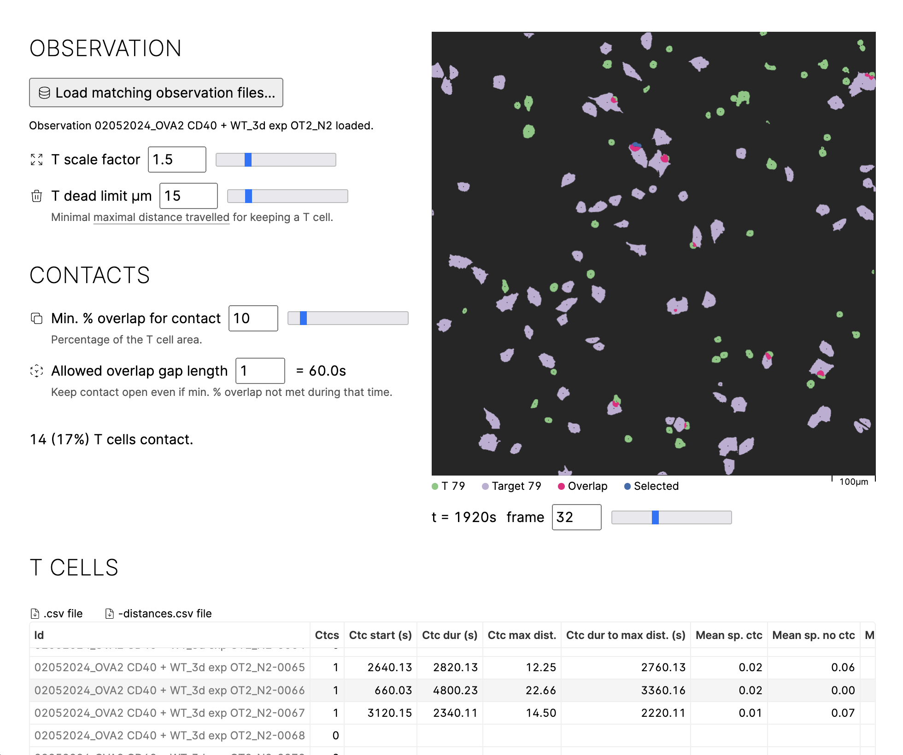

Cell contacts - Detect contacts between T and target cells
==========================================================

Processes paired [TrackMate] XML files to detect contacts between T
and target cells according to a few tweakable parameters.

[TrackMate]: https://imagej.net/plugins/trackmate/

```
b0 -- cell-contacts results data > results.csv
b0 -- .show-url app
```


